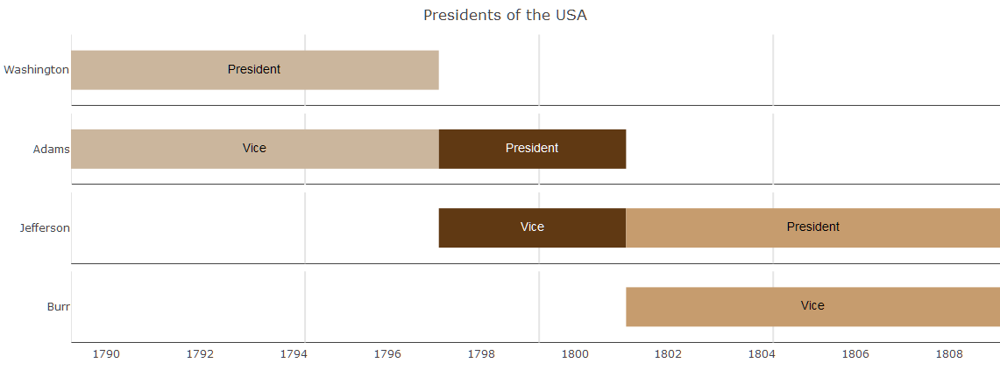

# vistime
####an R package for pretty timeline creation

Create _fully interactive_ timelines or Gantt charts using `plotly.js`. The charts can be included in Shiny apps and manipulated via `plotly_build()`.

Given a data frame containing event names and dates (can be `String`, `Date` or `POSIXct` in standard notation) and optionally groups, end dates for ranges, colors, tooltips or title, it creates a charming diagram of the given dates and events. It distinguishes between single events (having StartDate == EndDate) and ranges (given EndDate). Color column name can be handed over with the `color`-argument, if none are given, they are chosen from `RColorBrewer`.

**Feedback welcome:** shosaco_nospam@hotmail.com  

    

### Installation

To install the package from CRAN (not recommended at the moment, as the devtools-version contains a lot more fixes and features):

```{r}
  install.packages("vistime")
```

To install the development version (most recent fixes and improvements, but not released on CRAN yet), run the following code in an R console:
```{r}
  install.packages("devtools")
  devtools::install_github("shosaco/vistime")
```
     

### Usage

```{r}
vistime(data, start = "start", end = "end", groups = "group", events = "event", colors = "color", 
              fontcolors = "fontcolor", tooltips = "tooltip", title = NULL)
````


### Arguments
<table>
<colgroup>
<col width="2%" />
<col width="38%" />
</colgroup>
<tbody>
<tr>
<td>`data`</td>
<td>data.frame that contains the data to be visualised</td>
</tr>
<tr>
<td>`start`</td>
<td>(optional) the column name in data that contains start dates. Default: start.</td>
</tr>
<tr>
<td>`end`</td>
<td>(optional) the column name in data that contains end dates. Default: end.</td>
</tr>
<tr>
<td>`groups`</td>
<td>(optional) the column name in data to be used for grouping. Default: group.</td>
</tr>
<tr>
<td>`events`</td>
<td>(optional) the column name in data that contains event names. Default: event.</td>
</tr>
<tr>
<td>`colors`</td>
<td>(optional) the column name in data that contains colors for events. Default: color, if not present, colors are chosen via RColorBrewer.</td></tr>
<tr>
<td>`fontcolors`</td>
<td>(optional) the column name in data that contains the font color for event labels. Default: fontcolor, if not present, color will be black.</td></tr>
<tr>
<td>`tooltips`</td>
<td>(optional) the column name in data that contains the mouseover tooltips for the events. Default: tooltip, if not present, then tooltips are build from event name and date.</td></tr>
<tr>
<td>`title`</td>
<td>(optional) the title to be shown on top of the timeline</td>
</tr>
</tbody>
</table>

### Value

`vistime` returns an object of class "`plotly`" and "`htmlwidget`".


### Examples  

#### Basic Example
```{r}
library(vistime)
data(school)
head(school)
vistime(school, events="Language", groups="Room")

#>    Room                    Language             start              end
#>1 Room 1                     English  2017-03-14 14:00 2017-03-14 15:00
#>2 Room 2                      German  2017-03-14 15:00 2017-03-14 16:00
#>3 Room 3                      French  2017-03-14 14:30 2017-03-14 15:30
#>4   Bell Half Time of English Lesson  2017-03-14 14:30             <NA>
#>5   Bell      Begin of French Lesson  2017-03-14 14:30             <NA>
```


  
 
#### choose your own colors
````
dat <- data.frame(Position=c(rep("President", 3), rep("Vice", 3)),
                  Name = c("Washington", "Adams", "Jefferson", "Adams", "Jefferson", "Burr"),
                  start = rep(c("1789-03-29", "1797-02-03", "1801-02-03"), 2),
                  end = rep(c("1797-02-03", "1801-02-03", "1809-02-03"), 2),
                  color = c('#cbb69d', '#603913', '#c69c6e'),
                  fontcolor = rep("white", 3))

vistime(dat, events="Position", groups="Name", title="Presidents of the USA")
````



