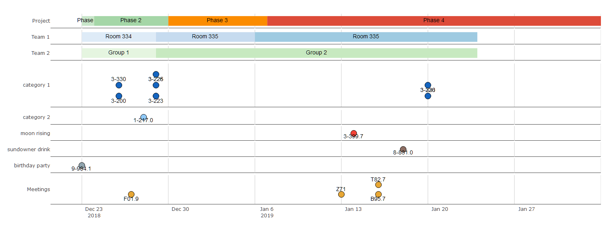

[](https://cran.r-project.org/package=vistime)
[](commits/master)
[](https://www.r-pkg.org/pkg/vistime)


# vistime
####an R package for pretty timeline creation

Create interactive timelines or Gantt charts using `plotly.js`. The charts can be included in Shiny apps and manipulated via `plotly_build()`.

Given a data frame containing event names and dates (can be `String`, `Date` or `POSIXct` in standard notation) and optionally groups, end dates for ranges, colors, tooltips or title, it creates a charming diagram of the given dates and events. It distinguishes between single events (having StartDate == EndDate) and ranges (given EndDate). Color column name can be handed over with the `color`-argument, if none are given, they are chosen from `RColorBrewer`.

**Feedback welcome:** shosaco_nospam@hotmail.com  

    

### Installation

To install the package from CRAN:

```{r}
  install.packages("vistime")
```

To install the development version (most recent fixes and improvements, but not released on CRAN yet), run the following code in an R console:
```{r}
  install.packages("devtools")
  devtools::install_github("shosaco/vistime")
```
     

### Usage

```{r}
vistime(data, start = "start", end = "end", groups = "group", events = "event", colors = "color", 
              fontcolors = "fontcolor", tooltips = "tooltip", title = NULL)
````


### Arguments
<table>
<colgroup>
<col width="2%" />
<col width="38%" />
</colgroup>
<tbody>
<tr>
<td>data</td>
<td>data.frame that contains the data to be visualised</td>
</tr>
<tr>
<td>start</td>
<td>(optional) the column name in data that contains start dates. Default: start.</td>
</tr>
<tr>
<td>end</td>
<td>(optional) the column name in data that contains end dates. Default: end.</td>
</tr>
<tr>
<td>groups</td>
<td>(optional) the column name in data to be used for grouping. Default: group.</td>
</tr>
<tr>
<td>events</td>
<td>(optional) the column name in data that contains event names. Default: event.</td>
</tr>
<tr>
<td>colors</td>
<td>(optional) the column name in data that contains colors for events. Default: color, if not present, colors are chosen via RColorBrewer.</td></tr>
<tr>
<td>fontcolors</td>
<td>(optional) the column name in data that contains the font color for event labels. Default: fontcolor, if not present, color will be black.</td></tr>
<tr>
<td>tooltips</td>
<td>(optional) the column name in data that contains the mouseover tooltips for the events. Default: tooltip, if not present, then tooltips are build from event name and date. <a href="http://help.plot.ly/adding-HTML-and-links-to-charts/#step-2-the-essentials">Basic HTML</a> is allowed.</td></tr>
<tr>
<td>title</td>
<td>(optional) the title to be shown on top of the timeline</td>
</tr>
</tbody>
</table>

### Value

`vistime` returns an object of class "`plotly`" and "`htmlwidget`".


### Examples  

#### Ex. 1: Presidents
````
dat <- data.frame(Position=c(rep("President", 3), rep("Vice", 3)),
                  Name = c("Washington", "Adams", "Jefferson", "Adams", "Jefferson", "Burr"),
                  start = rep(c("1789-03-29", "1797-02-03", "1801-02-03"), 2),
                  end = rep(c("1797-02-03", "1801-02-03", "1809-02-03"), 2),
                  color = c('#cbb69d', '#603913', '#c69c6e'),
                  fontcolor = rep("white", 3))

vistime(dat, events="Position", groups="Name", title="Presidents of the USA")
````


#### Ex. 2: Project Planning
````
data <- read.csv(text="event,group,start,end,color
                       Phase 1,Project,2016-12-22,2016-12-23,#c8e6c9
                       Phase 2,Project,2016-12-23,2016-12-29,#a5d6a7
                       Phase 3,Project,2016-12-29,2017-01-06,#fb8c00
                       Phase 4,Project,2017-01-06,2017-02-02,#DD4B39
                       Start,Start/today,2016-12-22,2016-12-23,#000000
                       today (after 32 days),Start/today,2017-01-23,2017-01-24,#DD4B39
                       1-217.0,category 2,2016-12-27,2016-12-27,#90caf9
                       3-200,category 1,2016-12-25,2016-12-25,#1565c0
                       3-330,category 1,2016-12-25,2016-12-25,#1565c0
                       3-223,category 1,2016-12-28,2016-12-28,#1565c0
                       3-225,category 1,2016-12-28,2016-12-28,#1565c0
                       3-226,category 1,2016-12-28,2016-12-28,#1565c0
                       3-226,category 1,2017-01-19,2017-01-19,#1565c0
                       3-330,category 1,2017-01-19,2017-01-19,#1565c0
                       4-399.7,moon rising,2017-01-13,2017-01-13,#f44336
                       8-831.0,sundowner drink,2017-01-17,2017-01-17,#8d6e63
                       9-984.1,birthday party,2016-12-22,2016-12-22,#90a4ae
                       F01.9,Meetings,2016-12-26,2016-12-26,#e8a735
                       E43,Meetings,2017-01-12,2017-01-12,#e8a735
                       R63.3,Meetings,2017-01-12,2017-01-12,#e8a735
                       Z71,Meetings,2017-01-12,2017-01-12,#e8a735
                       B95.7,Meetings,2017-01-15,2017-01-15,#e8a735
                       T82.7,Meetings,2017-01-15,2017-01-15,#e8a735
                       Room 334,Team 1,2016-12-22,2016-12-28,#DEEBF7
                       Room 335,Team 1,2016-12-28,2017-01-05,#C6DBEF
                       Room 335,Team 1,2017-01-05,2017-01-23,#9ECAE1
                       Group 1,Team 2,2016-12-22,2016-12-28,#E5F5E0
                       Group 2,Team 2,2016-12-28,2017-01-23,#C7E9C0")
                           
vistime(data)
````



